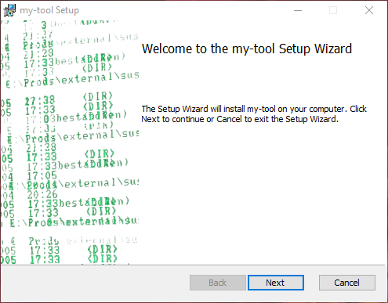
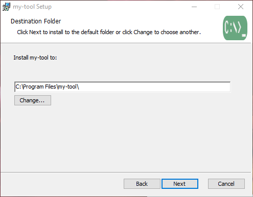
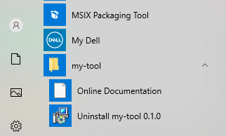
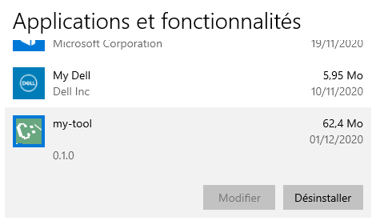

#  WIX-MSI

[![NPM version][npm-image]][npm-url]
[![JavaScript Style Guide][standard-image]][standard-url]
[![Language grade: JavaScript][lgtm-image]][lgtm-url]
[![Maintainability][code-climate-image]][code-climate-url]

Package node.js application to a standalone executable and pack it into a msi installer (Windows only).

<p align="center">

</p>

This module will:
- Create a standalone binary that does not require node,
- Pack it into a Windows msi installer that:
  - Extract info from package.json such as bin name, provider's name, and so on,
  - Automatically create a license panel in installer from LICENSE/LICENSE.md file, if any,
  - Automatically create in the windows start menu an entry that contains link to the homepage URL filled in package.json or provided in cli,
  - Automatically update the PATH environmement variable with the install folder.
- Allow to customize the installer and others as executable name, etc.,
- Next to the previous point, a validation of the user's input is performed to ensure their consistency.

Note it does not require any third-software pre-installed (binaries of the installer, _i.e._ wixtoolset, will be locally downloaded in the package installation folder from its official repository).

## Table of Contents

<!-- toc -->

- [Install](#install)
- [Use](#use)
- [Customize Installer and Installation](#customize-installer-and-installation)
  * [Important Settings](#important-settings)
    + [UUID](#uuid)
    + [Executable name](#executable-name)
  * [Installer UI](#installer-ui)
  * [Windows Applications Menu and Panel](#windows-applications-menu-and-panel)
- [Options](#options)
- [Rc file](#rc-file)
- [Known Limitations](#known-limitations)
- [Versioning](#versioning)
- [Credits](#credits)
- [License](#license)

<!-- tocstop -->

## Install

As this module introduces constraints to both target os and arch (respectively  win32 and x64), install it globally, as an optional dependency or launch it using npx to avoid to constrain your module with these settings.

```shell
npm i wix-msi -g
```

## Use

```shell
wix-msi target_bin
```
where target_bin is a bin entry of the package.json

## Customize Installer and Installation

### Important Settings

#### UUID

The Product unique identifier assigned to this installer/application. It could be set using the -U/--uuid flag.

  Note __once assigned, it should note be changed__ in order to be able to perform update.

  If not provided, it will be automatically generated and serialized in a file named .wixrc.

#### Executable name
  Executable of the node application is set by default with the target bin entry of the package.json.
  
  It could be changed using the -e/--exe flag to any name.

### Installer UI

 | 
--- | ---

The screenshots above show the UI with default settings.

Customization of the installer UI could be performed using the following options:

- __Left part of the introduction panel__:
  - The -B/--background flag allows to customize this part with a png/jpg image,
  - Image will be automatically resized to fit the expected size of {493x176}.
- __Top Banner of panels__:
  - -b/--banner flag allows to put an image (png/jpg) on the right part of the banner of panels (expected the intro one),
  - This place is for a {90x48} image,
  - Image will be automatically resized to fit the expected place trying to keep user's image ratio at best.
- __Background color__:
  - Using -c/--color flag with a css-like color (_i.e._ either named or hexadecimal one) allows to customize (part of) the background color of panels.
- __License panel__:
  - Automatically added to the installer if a LICENSE/LICENSE.MD file is found,
  - Adding --no-l/--no-license flag allows to not include it.


### Windows Applications Menu and Panel

 | 
--- | ---

The screenshots above show the installation result in both application menu and application panel.

Customization of the installation could be performed using the following options:

__Windows Application Menu__

  - __Shorcut Link__:
    - Using the -H/--homepage allows to change URL of the link sortcut added to the directory of the windows menu for this application.
    - Default value use the homepage set in package json, if any,
    - If not, no shortcut link is created.

__Windows Application Panel__

 - __Icon of application__:
    - Using the -i/--ico allows to modify the icon used for the Windows application panel. 
    - Icon should be a png/ico image,
    - Image will be automatically resized to fit the expected size of {256x256}.


## Options

option | desc | value | default
--- | --- | --- | ---
-l / --license | include license panel in msi installer (Done if a LICENSE or LICENSE.md file is found) | boolean | true
-e / --exe | modify the executable name | string | package.bin[target_bin]
-d / --dir | build folder | path(*) | ./build
-H / --homepage | URL of the shortcut added to menu directory (not added if undefined) | URL | package.homepage
-a / --author | Provider name of the package | string | package.author
-i / --ico | Icon displayed in Windows application panel (.ico or png file). Note png file will be automatically resized to a 256x256 image | path(*) | assets/icon.png from this module
-b / --banner | Image used on the right of the top banner of installer panels (a 90x48 png/jpg image). Note it will be automatically resized to expected size keeping its ratio as best | path(*) | assets/banner.png from this module
-B / --background | left image displayed in the introduction panel (a 493x176 png/jpg image). Note it will be automatically resized to expected size| path(*) | assets/background.png from this module
-c / --color | Background color of panels  | css color | 'white'
-U / --uuid | Product unique identifier | uuid  | automatically generated if not provided (and saved in wixrc file)
-s / --save | Save settings in .wixrc file | boolean  | n.a.

(*) path must be relative from the execution directory.

## Rc file

A .wixrc file could be use to store options:

```json
{
  "target-bin": {
    "uuid": "12345678-90ab-cdef-1234-567890abcde",
    "icon": "./myIcon.png"
  }
}
```

Using the -s/--save option will generated it if the validation of user's settings succeed.

## Known Limitations

- Package version should follow the x.y.z format (it does not work with beta/rc or other usual suffix of version of node module). If not, the validation step will raise and
error and stop the packaging.
- Note it does not deal with signing the produced installer _i.e._ installing the msi on other computer could araise the "Windows Defender Smartscreen" about unrecognized app. Have a look ([here][stack-url]) about the need of EV certificates for such purposes.

## Versioning

While it's still in beta, version will follow v0.Y.Z format, where:
- Y: Major (could imply breaking changes),
- Z: Minor or patch.

## Credits

- Nicolas Barriquand ([nbarikipoulos](https://github.com/nbarikipoulos))

## License

This module is MIT licensed. See [LICENSE](./LICENSE.md).

[npm-url]: https://www.npmjs.com/package/wix-msi
[npm-image]: https://img.shields.io/npm/v/wix-msi.svg
[standard-url]: https://standardjs.com
[standard-image]: https://img.shields.io/badge/code_style-standard-brightgreen.svg
[lgtm-url]: https://lgtm.com/projects/g/nbarikipoulos/wix-msi
[lgtm-image]: https://img.shields.io/lgtm/grade/javascript/g/nbarikipoulos/wix-msi.svg?logo=lgtm&logoWidth=18
[code-climate-url]: https://codeclimate.com/github/nbarikipoulos/wix-msi/maintainability
[code-climate-image]: https://api.codeclimate.com/v1/badges/796eb7fd76e1ae8e24fa/maintainability
[stack-url]: https://stackoverflow.com/a/51113771
